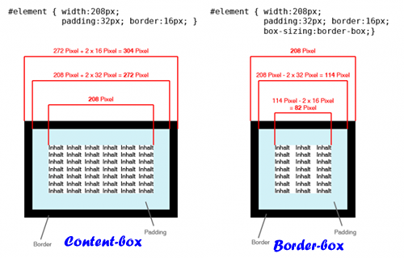

# es6的准备

箭头函数可以简单的解决this指向

class类


# es6 中的class

代替构造函数作为 构造函数

### es6与es5构造函数的不同

> 1.定义方式不同
>
> 2.定义实例属性方式不同
>
> 3.定义原型方法方式不同

es5

```js
function Hello(){
  this.say = say;
}
new Hello();
```


### 定义构造函数基本语法

```js
class Hello{
  
}
//只能new Hello不能调用Hello
```

#### 给实例添加属性

> es5给普通构造函数添加属性

```js
function User(age,name){
  this.age = age;
  this.name = name
}
var u =new User(998,'cyx')
```

> es6中class添加实例属性

```js
class User{
  //constructor就是类的构造函数
  constructor (age,name){
    this.age = age;
    this.name = name
  }
}
new User(998,'cyx')//new User调用的是constructor
```


#### 给class添加原型方法

> es5添加原型方法

```js
function User(age,name){
  this.age = age;
  this.name = name
}
User.prototype.hello = function(){console.log(this.name)}
```

> es6 class添加原型方法

```js
class User {
  //这里写在User内部的省去了function关键字的方法就是原型方法
  hello2(){
    
  }
  //多个方法不需要逗号隔开
  hello(){
    
  }
}
//也可以如es5一样通过prototype给构造函数加原型方法
User.prototype.hello = function(){console.log(this.name)}
```

#### 补充说明

```js
class User {
  
}

//等同于
class User{
  constructor(){
      //默认不写也有一个constructor
  }
}
```


## class实现继承的方式

```js
//人类
class Person(){
  constructor(){
    this.name = 'cyx'
    this.age = 18
  }
}
//中国人类，继承人类
//使用extends关键字来实现继承
class ChinaPerson extends Person{
}
//这个u其实是Person的实例,也是ChinaPerson的实例
const u = new ChinaPerson()
console.log(u.name)//cyx
```

> 等同于

```js
class Person(){
  constructor(){
    this.name = 'cyx'
    this.age = 18
  }
}
//中国人类，继承人类
//使用extends关键字来实现继承
class ChinaPerson extends Person{
  constructor(){
    //调用父类的Person的constructor,就会继承Person的实例
    //也就是将this指向父类的实例（不是原型继承）
    //注意:super 一定要在contructor的第一行来写
    super()//相当于拷贝了 Person()
    console.log(this)
  }
}
//这个u其实是Person的实例,也随ChinaPerson的实例
const u = new ChinaPerson()
console.log(u.name)//cyx
```

继承的目的:

//代码重用


# JSX语法(js+xml)

xml与html区别,xml标签必须闭合``


就是使用js的方式来写html

```jsx
//const str = '<h1></h1>'//以前的方式
const str = <h1 xx="18">我是小明</h1> //JSX请求写html,str称为react元素
//相当于
const obj = {
  type:'h1',
  props:{
    xx:'18',
    id:'99',
    children:'我是小明'
  }
}  
```


# 使用：

### 需先下载两个包

> `npm install react react-dom -S`
>
> react包用来处理react元素
>
> react-dom包用来将react元素添加到dom中

### 1.定义一个react元素,注意react元素必须有一个根元素

```jsx
import React from 'react'
//这个不用引号包裹的标签，称之为react元素
//这个react元素最终会被渲染到dom,形成一个div元素
const ele = <div id='998'></div>
```

### 2.将react元素渲染到dom中

> 通过ReactDom的render方法将指定react元素渲染到dom中
>
> 参数1:要渲染的react的元素
>
> 参数2:指定参数一要渲染到什么位置(必须是通过原生js获取的原生dom对象)

```jsx
import React from 'react'
import ReactDom from 'reactDom'
const ele = <div id='17' age="18">我是小明</div>
      
//参数2必须是原生dom元素
ReactDom.render(ele,document.querySelector('#box'))
```


### 3.借助webpack babel让上述代码能在浏览器中运行

babel-loader也可以将jsx语法转为常规的es5(转为一个js对象)

webpack.config.js

```js
 // loaders
    // rules
    // 配置让其他的第三方包来处理非js后缀的文件
    //将jsx语法解析为es5
      {
        test: /\.js/,
        loader: 'babel-loader',
        exclude: /node_modules/, // 忽略,不处理 node_modules中的js文件
      }
```

.babelrc

```js
{
    //配置babel
    //presets用来指定进行语法转化的包
    //env对应的包是babel-preset-env,作用是将es678转为es5
    //react对应的包是babel-preset-react 作用是将jsx语法转为js语法
    "presets": [
        "env",
        "react"
    ]
}
```


#### 注意:

​	1.react元素中的标签要闭合

​	2.属性要写为驼峰的写法,如`autofocus`要写为`autoFocus`

​	3.class与for属性需要写为`className`和`htmlFor`,避免关键字

```jsx
const element = <div className='test'></div>
const element = {
  type:'div',
  props:{
    className:'test'
  }
}


const element = <label htmlFor='test'></label>
const element = {
  type:'label',
  props:{
    htmlFor:'test'
  }
}
```


### 4.在react元素中混写js代码

```jsx
const name = '我是cyx'
const ele = <h1>{ name }</h1>
const element = {
  type:'h1',
  props:{
    children:name
  }
}
```

```jsx
const name = '我是cyx'
const ele = <h1>{ 'hello,'+name }</h1>
```


### 5.事件注册

```jsx
const ele = <button onClick={ function(){alert(18)} }>呵呵</button>
const ele ={
  type:'button',
  props:{
    onClick:function(){
      alert(18);
    }
  }
}        
ReactDom.render(ele,document.querySelector('#box'))


function handler(){
  alert(123)
}
const ele2 = <button onClick={ handler }>呵呵</button>
ReactDom.render(ele2,document.querySelector('#box'))


//传参时,不能直接加括号
const ele3 = <button onClick={ ()=>{handler(msg)} }>呵呵</button>
      
      
      
//渲染多个
  const eleAll = <div>{ele}{ele1}</div> 
```


react元素第一个标签不要换行，如果非要换行就在标签外包一个()

```jsx
const element = (
  <div>
  </div>	
)
```


### 6.jsx语法对表单控制进行操作(input)

//无双向数据绑定

1.如何给input赋值

2.如何得到input中的value值

注意:

- 使用value属性给input赋值，默认是只读的，输入框不能再输入内容了

- 通常让只读变为可以编辑的方式:1)通过onChange得到最新的值，把这个值重新保存到某个变量中

  ​							2)调用重新渲染DOM的方法，在渲染时把这个新的变量赋给表单的value

```jsx
 //若要修改则必须: a.通过onChange事件获取实时表单的值放到一个变量中
                //b.通过setState更新模板中即react元素中相应的值
```


react的onChange事件同原生的js的onchange不同它会在数值改变时就触发

注:在react元素中调用js函数,表达式，包括注释必须放在{}中

​	而且为了事件的this指向组件实例通常在{}中书写箭头函数


### 7.jsx渲染数据列表

```jsx
const data = [
  {id:1,name:'小明',salary:'20k'},
  {id:2,name:'小红',salary:'20k'},
  {id:3,name:'小工',salary:'15k'}
]

const arr = [<li>小明</li>,<li>小红</li>,<li>小工</li>]
//react内部会将数组arr中的元素展开渲染,要求有一个key用来作性能优化
const xx = <ul>{arr}</ul>
```

注释和其他js代码都要包在{}里面


### 8.控制元素样式(style,className)

```jsx
const ele = <div className="hide"></div>

      //如果用style控制样式应该是一个对象
      
const ele = <div style={ {color:'red',backgroundColor:'grenn'} }>我是</div>
```


# react组件(要求构造函数首字母大写)

> 可以认为是对react元素的封装

### a.普通函数组件

> 函数必须返回一个react元素

```jsx
//这个返回了react元素的Btn方法就是react组件
function Btn(props){
  const ele = <div>我是{props.name}</div>
  return ele
}
ReactDom.render(Btn({name:'小明',age:18,sex:'男'}),dom对象)
//如果写成标签形式默认会将标签上的属性组成一个对象
//并把这个对象作为Btn方法的参数传递
ReactDom.render(<Btn name={'小明'} age={ 28 } sex='男' />,dom对象)//推荐写法，就是调用Btn方法的意思
```

注意:

> 组件方法名要大写
>
> 给方法传递的参数应该写在标签的属性上

### b.构造函数形式的组件

> 1.这个构造函数必须有一个原型的render方法或者实例上的render方法
>
> 2.这个render方法必须返回一个react元素
>
> 3.这个构造函数要继承自React.Component//继承的目的是为了使用Component的方法或者数据

```jsx
import React from 'react'


function Btn(){
  this.render = function(){
    const ele = <h1>我是btn构造函数形式的组件</h1>
     return ele
  }
}
//这个Btn就是构造函数形式的组件
Btn.prototype = new React.Component()
const btn = new Btn()
ReactDom.render(new Btn().render(),dom对象)
ReactDom.render(<Btn />,dom对象)//推荐写法

//当我们写<Btn />是会判断如果Btn是普通函数，则直接调用
//如果继承自React.Component会先new Btn()再调用实例的render方法
```


### 带参数的构造函数组件

> 无论是普通函数组件还是构造函数组件都可以在标签上添加属性
>
> 添加的属性都会在props对象中

```jsx
//普通函数组件
function Btn(props){
    // props //  {id: 20, name: '小明', children: 'ddd'}
  const ele = (<div>我是普通函数组件</div>)
        return ele
}
//如果写在 标签形式，默认会将 标签上的属性组成一个对象,
ReactDom.render(<Btn name='小明' age={20}/>)
ReactDOM.render(Btn({name: '小明', age: 18, sex:'屁'}), document.querySelector('#box'))

//构造函数

function Btn () {
  this.render = function () {
    // this.props // {id: 10, name: '小明', children: 'ddd'}
    return <div></div>
  }
}
Btn.prototype = new React.Component()
//双标签内部的内容会加在props的children上
<Btn id={10} name='小明'>ddd</Btn>
```


# 加法计算器:


this.setState({})方法会重新渲染当前组件,内部重新调用render方法，将render方法的返回值渲染到页面上去

//是从React.Component中继承过来的

```jsx
//1.使用react的三步
//引包
//定义react元素
//将react元素渲染至页面
import React from 'react'

import ReactDom from 'react-dom'


    

    //在react中表单默认的值默认只读
    //若要修改则必须: a.通过onChange事件获取实时表单的值放到一个变量中
                   //b.通过setState更新模板中即react元素中相应的值
    //注:这个onChange不同于js的原生onchange，他会在值一改变时即触发
        //在react元素中调用js函数,表达式，包括注释必须放在{}中
        //而且为了事件的this指向组件实例通常在{}中书写箭头函数

//使用构造函数组件
    //1.建立有render方法的构造函数,首字母要大写
    function Calc(){
        this.numA = 0;
        this.numB = 0;
        this.total = 0;
        this.render = function(){
            //2.render方法必须返回一个react元素
            //换行应加()
            return (
                <div>
                    <input onChange={
                        (e)=>{
                           //为了事件的this指向组件实例通常在{}中书写箭头函数
                            this.valueChangeA(e)
                        }
                        } type="text"/>
                    <span>+</span>
                    <input onChange={
                        (e)=>{
                             //为了事件的this指向组件实例通常在{}中书写箭头函数
                            this.valueChangeB(e)
                        }
                        }
                    type="text"/>
                    <button onClick={ e=>{
                        this.total = this.numA-0 + (this.numB-0)
                        this.setState({})
                    }}>=</button>
                    <h1>{ this.total }</h1>
                </div>
            )
        }
        this.valueChangeA =function(e){
            this.numA=e.target.value
            //更新
            this.setState({})
        }
        this.valueChangeB =function(e){
            this.numB=e.target.value
            //更新
            this.setState({})
        }
        
        
    }
    //3.继承React.Component的组件的方法及属性
        Calc.prototype = new React.Component();
    //使用方式 a.  new Calc().render();若有参数则相当于绑给Calc的实例后再调用render方法
            //b.   标签传值或有内容时都作为实例的props属性传递,推荐
    ReactDom.render(<Calc />,document.querySelector('#box'))
```


# class形式的组件

```jsx
class Btn extends React.Component{
  //原型方法
  contructor(){
    super()
  }
  hello(){
    
  }
}
```


# setState与this.state的扩展

- 将数据放在this.state中利于通过setState({})重新渲染元素
- 可以合并为一行this.setState({age:Math.random()})会覆盖this.state中的同名属性就达到了重新渲染
- 当我们调用setState会先更新this.state中的数据然后再调用当前组件的render方法


# 组件的生命周期（生命周期函数-生命周期钩子）

### 基础概念

1.组件的出生

constructor()//new的时候就会触发

2.长全了的函数

componentDidMount()//表示组件内即render方法中返回的标签已被添加到了dom中,在render后执行

3.销毁

componentWillUnmount// 即将被销毁()

4.更新

componentDidUpdate组件更新（render）之后

componentWillUpdate组件更新（render）之前


### 详细用法:

#### 1.

> #### componentWillMount()：
>
> 表示即将渲染，在render之前执行，可以用于设置一些前置操作
>
> #### componentDidMount():
>
> 表示已经渲染,在render之后执行，这时即使更改state的值也不会影响render中渲染的效果，除非调用setState({})重新渲染


#### 2.

> componentWillUnmount表示即将被销毁即render方法返回的标签即将被移除
>
> #### 注:必须是原先元素render方法return返回的值为空才能触发，其他dom操作都不可以
>
> 方法：重新render为其他元素或者调用路由


#### 3.执行顺序

constructor->componentWillMount->render->componentDidMount   而setState相当于再次调用了render


### 4.

setState相当于先调用componentWillUpdate再调用render然后再调用componentDidUpdate

所以不能在componentWillUpdate，render，componentDidUpdate中再调用setState方法


```jsx

import React from 'react'
import ReactDOM from 'react-dom'

class App extends React.Component {
  constructor () {
    super()
    this.state = {
      age: 18
    }
    console.log('我是: constructor')
  }
  //表示组件即将被渲染到DOM中
  componentWillMount () {
    console.log('我是: componentWillMount')
    this.state.age = 999
  }
  // 表示组件已经被渲染到DOM中
  componentDidMount () {
    console.log('我是: componentDidMount')
    // this.state.age = 998
    // this.setState({}) //
    setTimeout(() => {
      this.state.age = 998
      this.setState({})
    }, 3000)
  }
  // 表示组件即将被消毁(组件中render方法返回的标签即将要从dom中移除)
  componentWillUnmount () {
    console.log('我是: componentWillUnmount')
  }
  // 组件更新之前
  componentWillUpdate () {
    console.log('WillUpdate')
    // this.setState({})
  }
  // 组件更新之后
  componentDidUpdate () {
     console.log('DidUpdate')
     // this.setState({})
  }
  // this.setState() // componentWillUpdate render componentDidUpdate
  render () {
    // this.setState({age: 10})
    // if (false) {this.setState({})}
    console.log('我是: render')
    return (
      <div>
        <h1>我是小明明: {this.state.age}</h1>
        <button onClick={e => this.clickHandler()}>点击按钮</button>
      </div>
      )
  }
  clickHandler () {
    // console.log()
    // this.state.age = 1000
    this.setState({age: 1000})
  }
}

// const Test = () => <h1>我不是App组件</h1>
const Test = function () {
  return <h1>我不是App组件</h1>
}
ReactDOM.render(<App></App>, document.querySelector('#box'))


// setTimeout(function () {
//   ReactDOM.render(<Test></Test>, document.querySelector('#box'))
// }, 3000)
```


# 组件之间的通信(传递数据)

## 父子组件之间传值

直接在父组件中写子组件标签就可以调用

### 父给子:利用组件的props属性完成

在子组件的标签上添加属性，则在组件中可以通过props属性得到父组件传递的数据

### 子给父

1.在父组件中定义一个方法用于修改父组件中的数据

2.把定义好的方法传递给子组件，传递的目的是为了让子组件调用

3.在子组件中调用父组件传递的方法，并可以给方法传递参数（当想传递数据给父组件时调用）

.jpg)


## 非父子组件之间的通信(如兄弟组件或多层嵌套组件)

busEvent(自定义)

Redux(相似于vuex)

`bus.js`

```js
//用来处理非父子组件传值
const data = {}//存储处理数据的方法
const bus = {}//第三方实例


bus.$on = function(name,fn){
    //将处理数据的函数名及函数体以键值对的形式存入对象
    data[name]=fn
}
bus.$emit = function(name,arg){
    //利用name找到data中对应处理数据的方法
    //并将数据作为参数传入
    const fn = data[name]
    fn(arg)
}
export default bus
```

`index.js`

```jsx

import React from 'react'
import ReactDom from 'react-dom'


//引入bus插件处理组件间传值
import bus from './bus'


const BroA=()=>{
   const msg = 18
    return (
        <div>
            <button onClick={e=>{bus.$emit('mark',msg)}}>发给BroB</button>
            我是BroA
        </div>
    )
}
const BroB=()=>{
        bus.$on('mark',function(msg){
            alert(msg)
        })
        return (
            <div>
                我是BroB
            </div>
        )
    }

const App=()=>{
    return (
        <div>
            <BroA></BroA>
            <BroB></BroB>
        </div>
    )
}


ReactDom.render(<App />,document.querySelector('#box'))
```


# 顶级父类给所有子代传值(如:爷爷给孙子)

### 使用this.context全局变量,官方不推荐使用,通常通过redux代替

1.在父组件中将传递的数据放在getChildContext方法的返回值中

```js
getChildContext(){
  return {
    userName : this.state.userName
    callback: this.cbChange.bind(this) 
  }
}
```

2.父组件设置传递的数据的格式

```js
App.childContextTypes = {
  userName:React.PropTypes.string,
  callback:React.PropTypes.function
}
```

3.子组件设置传递的数据的格式,符合时就可以通过this.context接收了

```js
ChildSon.contextTypes = {
  userName:React.PropTypes.string,
   callback:React.PropTypes.function
}


render(){
  console.log(this.context)
}
```


```jsx
// 需要三个组件，爷爷直接给孙子传递数据(不一定是孙子，只要是子辈都可以)
import React from 'react'
import ReactDOM from 'react-dom'
import PropTypes from 'prop-types'
class ErZi extends React.Component {
  render () {
    console.log(this.context)
    this.context.testFn()
    return (
      <div>我是儿子： 我爷爷今年: {this.context.age}</div>
      )
  }
}
// 3.
ErZi.contextTypes = {
  age: PropTypes.string,
  testFn: PropTypes.function
}
class FuQin extends React.Component {
  render () {
    console.log('爷爷:', this.props.age)
    return (
      <div>
         <h1>我是父亲</h1>
         <ErZi></ErZi>
      </div>
      )
  }
}

class YeYe extends React.Component {

  render () {
    // const age = '998'
    return (
      <div>
        <h1>我是爷爷</h1>
        <FuQin></FuQin>
      </div>
      )
  }
  testFn () {
    window.alert('我被调用')
  }
  //添加了这个方法就可以在所有子辈上访问这个顶级父类的方法或属性了
  //但是需限制这个方法传递的参数的格式
  //通过prop-types组件实现限制
      //发送数据方设置childContextTypes
      //接收数据方设置contextTypes
  //只要满足限制的组件才能绑定传递数据的方法
  getChildContext () {
    return {
      age: '18',
      testFn: () => {
        this.testFn()
      }
    }
  }
}
// 2.
YeYe.childContextTypes = {
  // 限制这里传递的age必需是string格式
  age: PropTypes.string,
  testFn: PropTypes.function
}
ReactDOM.render(<YeYe></YeYe>, document.querySelector('#box'))

// 传递的步骤:
// 1.在爷爷组件中添加一个 getChildContext 原型方法,
// 并且返回一个，要传递的数据在对象存储 (这个方法是在render后被调用)
// 2.要给爷爷组件这个类, YeYe 添加一个 childContextTypes 属性,用来限制
// 传递给子组件的数据的格式: 需要下载一个包： `npm i prop-types -S`
// 3.在要接收数据的子组件中给组件添加一个 contextTypes属性，用来限制接收的数据
// 的格式
// 上面3步之后，就可以在子组件中使用 this.context 来获取爷爷组件传递的数据

```


# 更改this指向的方法

call,apply,bind

es6的箭头函数

es7的::this法


# react中获取原生dom的方式，在元素标签上加ref属性，通过this.refs获取


# 在react中阻止默认事件只能用preventDefault，因为return false在之前代码报错时就不会执行到这


# 用setState渲染时只会重新渲染当前组件和当前组件的子组件


# 关于let和const

1.全部使用let，当发现某个变量不想被修改时使用const

2.全部使用const，当发现某个变量想被修改时使用let


# 简化input的onChange事件注册：

1.将onChange事件抽离为一个单独的方法

```jsx
comChange(e,val){
  this.state[val]=e.target.value
  this.setState({})
}


render(){
  return (
  	<div>
    	<input type="text" onChange={e=>this.comChange(e,this.state.name)}/>	
      	<input type="text" onChange={e=>this.comChange(e,this.state.age)}/>	
    </div>	
  )
}
```

2.Object.defineProperty


# 函数剩余参数列表

```jsx
 {
        // 标记
        // rest argument
        // test('a', 'b', 'c')
        // function test(...arg) {
        //   arg // ['a', 'b', 'c'], 相当于arguments
        //   this.addTodo(...arg)// 相当于 this.addTodo('a', 'b', 'c')
        // }
      }
```


# 路由4.0(react-router-dom)

react的路由是所有框架中最简单的

```jsx
import {HashRouter,Route} from 'react-router-dom'//这个包中封装了很多组件
//监听hash值的变化
//根据Route指定的规则呈现不同的组件
//使用要求
//a.组件最外层需要使用HashRouter包裹，嵌套路由时只需写一个
//b.HashRouter组件标签中间只能有一个根元素

//首页组件
const Home = ()=>(
<div>
 	<h1>首页</h1>
 </div>
)


const App = ()=>{
  return (
    <HashRouter>
    	<div>
          	<h1>dddd</h1>	
  			<Router path='/home' component={Home}></Router>
          	<h1>fff</h1>
    	</div>
    </HashRouter>
  )
}
```


# history.pushState(null,null,'/test')

​	可以达到类似hash变化的效果(更改地址栏而不刷新页面),这样就不需要在地址栏加#

这就得加一个BrowerRouter组件


# Route标签中的path问题

Route中的path属性默认是模糊匹配，只要锚点中是以这个path开头这个组件就会呈现

可以通过添加exact属性来达到精确匹配的效果

`<Route exact>`或者`<Route exact={true}>`


# NavLink

NavLink组件可以为当前点击的元素加一个样式


# 路由导航的方式

标签形式

```jsx
<Link to='/home'></Link>
<NavLink to='/home' activeClassName='test'></Link>
//NavLink与Link不同点是NavLink点击时会自动添加一个test样式名
```

js形式

```jsx
props.hsitory.push({pathname:'/home'})
props.hsitory.go(-1)
props.hsitory.goBack()
```


# 嵌套路由

注意：

​	1.在需要进行路由转换的Dom位置写Route标签就可以完成跳转和渲染,不同于vue

​	 2.react中子组件的路由path设置中必须追加父组件路由的path，这点不同于vue

可以通过props.match.path来动态的代表父路由以拼接到子路由上


# Redirect组件(用于作页面跳转)

redirect本身是立即跳转到指定路由的

//需要和Swith 组件中使用

//可以把路由包裹在Switch

//如果Redirect包裹在Switch中时，当Switch所有的路由都不匹配时Redirect才执行跳转


# 动态路由匹配

/detail/:id

//react通过props.match.params.id

//注意动态路由即加了参数后就是精确匹配了,即使不加exact


# 保证组件内this指向的另一种方法(非箭头函数)

bind返回值是一个被改变this指向的方法

```jsx
constructor(){
  super()
  //指将this指向改为当前组件实例
  this.handlerClick = this.handlerClick.bind(this)
}
//这样就可以直接用this了
render(){
  return (
  	<div><button onClick={this.handlerClick()}>按钮</button></div>
  )
}
```


# 微信ui界面框架weui


# Redux

http://www.redux.org.cn/

https://redux.js.org/

> redux本身和react是没有关系的
>
> 只是用来管理数据的一种方式，类似于vuex
>
> //dispatch,createStore
>
> state可以是任意类型不同于vuex的必须是对象

#### Redux.createStore

> createStore是redux中提供的全局属性，用于创建一个创建仓库
>
> 需要提供一个修改仓库数据的reducer方法作为参数
>
> reducer的第一个参数代表state数据，返回值是新的state
>
> store.getState()也可以获取到全局数据
>
> 

### 步骤:

1.需要定义一个用来修改状态(state)的方法(reducer)

//参数一：store中的状态(state),默认是undefined

//参数二:dispatch的action对象，可用于判断操作类型以进行不同操作

//返回值:是Store中的新的状态(state),会覆盖之前的状态,默认返回值为undefined

2.调用Redux.createStore创建一个仓库

参数是reducer函数，传入时就会立即执行，默认返回值为undefined,如果reducer中有了返回值就可以达到state的初始化

通过store.getState可以获取state的值

3.执行store.dispatch(action对象)以再次调用reducer方法达到数据修改

参数action对象代表对state的一个新的操作,如{type:'Add',newVal:newVal}可通过type进行操作判断，通过newVal获取新的值


dispatch参数是action,表示要做的操作类型

#### 案例:使用redux完成加减

##### 简版

```html
<!DOCTYPE html>
<html lang="en">
<head>
    <meta charset="UTF-8">
    <meta name="viewport" content="width=device-width, initial-scale=1.0">
    <meta http-equiv="X-UA-Compatible" content="ie=edge">
    <title>Document</title>
</head>
<body>
    <input type="text" >
    <button class="add">+</button>
    <button class="remove">-</button>
    <script src="../node_modules/redux/dist/redux.js"></script>
    <script>
    const oInp = document.querySelector('input');
    const oAdd = document.querySelector('.add');
    const oRemove = document.querySelector('.remove');
    //使用redux进行全局状态(数据)的管理
    //分三步:
    //1.创建reducer函数对全局状态进行初始化及操作
    function reducer(state,action){
        //参数一：代表全局状态state,初始为undefined
        //参数二：代表dispatch调用时传入的操作对象，包括操作类型type,新的值newVal等
        if(state === undefined){
            state = 0
        }
        switch(action.type){
            case 'add':
                state ++;
                break;
            case 'remove':
                state --
                break
        }
        return state;//返回新的state达到状态的更新
    }

    //2.通过Redux的createStore创建仓库并会传入定义好的reducer函数以初始化状态state
    const store = Redux.createStore(reducer)//完成仓库初始化,相当于Vuex.Store
    //可通过store.getState获取到全局状态
    oInp.value = store.getState()
    //3.通过store.dispatch方法再次调用reducer对state进行操作
    oAdd.onclick = function(){
        //参数为一个action对象type为操作类型，用于reducer判断操作类型
       store.dispatch({type:'add'}) 
       oInp.value = store.getState()
    }
    oRemove.onclick = function(){
        //参数为一个action对象type为操作类型，用于reducer判断操作类型
       store.dispatch({type:'remove'}) 
       oInp.value = store.getState()
    }
    
    </script>
</body>
</html>
```

##### 封装版

```js
//reducer.js
//用来初始化state和操作state

//获取操作类型
const {ActionType} = require('./actions') 

function reducer(state,action){
    if(state===undefined){
        state = 0
    }
    switch(action.type){
        case ActionType.ADD:
        state += action.newV
        break;
        case ActionType.REMOVE:
        state --;

    }
    return state;
}
module.exports = reducer


/////////////////////////////////////////////////////////////////////////////////////////


//actions.js
//设置action对象


//设置操作类型
const ActionType = {
    ADD:'add',
    REMOVE:'remove'
}

function Add(newVal){
    return {
        type:ActionType.ADD,
        newV:newVal
    }
}

function Remove(){
    return {
        type:ActionType.REMOVE
    }
}


module.exports = {
    ActionType,
    Add,
    Remove
}


////////////////////////////////////////////////////////////////////////////////////

//store.js
//初始化仓库

const {createStore}=require('redux')

//引入reducer
const reducer = require('./reducer')

const store = createStore(reducer)


module.exports = store


////////////////////////////////////////////////////////////////////////////////////////
//index.js
//操作state

const oInp = document.querySelector('input');
const oAdd = document.querySelector('.add');
const oRemove = document.querySelector('.remove');

const store = require('./store')
const action = require('./actions')


oInp.value = store.getState();

oAdd.onclick = function(){

   store.dispatch(action.Add(1)) 
   oInp.value = store.getState()
}
oRemove.onclick = function(){
 
   store.dispatch(action.Remove()) 
   oInp.value = store.getState()
}
```


export default 相当于model.exports

export相当于exports


# 图片路径错误解决方式

vue会自动处理图片路径(vue-loader)，而react使用webpack默认不会处理这些路径

解决方式:

1.通过webpack的copy-webpack-plugin将静态资源复制一份到打包后的文件下


## **CSS3的box-sizing**

box-sizing语法：

> box-sizing ： content-box || border-box || inherit;

- **当设置为box-sizing:content-box时，将采用标准模式(w3c)解析计算，也是默认模式；**
- **当设置为box-sizing:border-box时，将采用怪异模式(ie)解析计算；**




# this.setState补充

this.setState({[key]:e.target.value})//key就可以是一个变量


# NavLink补充

to属性的值可以是字符串也可以是对象

`<NavLink to={pathname:'/home'}>`


# react也可以用axios发请求

react将axios绑定到全局的方法：React.axios = axios


# axios拦截器实现全局对响应错误时（如都有errmsg的情况）的判断

```js
axios.interceptors.response.use(res=>{
  if(res.data.errcode !== 0){
    alert(res.data.errmsg)
    return Promise.reject('err');//返回promise的reject的方法就会中断所有axios.then()的第一个参数方法
  }
  return res
})
```


# 解构对象的属性的属性

{data:{errcode,errmsg}}解构了data对象中的errcode,errmsg属性


# react模板jsx{}中本身不支持直接写if判断,用三元表达式或函数替换

 JSX 只是函数调用和对象创建的语法糖


# react中也可以使用ref属性进行父子组件间的传值

即父组件引用子组件时通过ref传递的是子组件的实例


# 跨域请求

jsonp要求前后端搭配

cors跨域要求后端

反向代理(apache，php的file__get_contents)要求前端操作


# react中以对象的形式处理类名的添加需要下载npm包classNames或者自己封装


# react中单选框

```jsx
<label className="radio-inline">
  <input
    onChange={e => this.handlerChangeValue(e, 'gender')}
    type="radio" value="0" checked={gender == 0} /> 男
</label>
<label className="radio-inline">
  <input
    onChange={e => this.handlerChangeValue(e, 'gender')}
    type="radio" value="1" checked={gender == 1}/>  女
</label>
```


# react中复选框

```jsx
 测试多选框
                                <input type="checkbox"
                                // onChange={e => this.handlerChangeValue(e, 'isArgee')}
                                onChange={
                                  e => {
                                  // this.state.user.isAgree = e.target.checked
                                  this.state.user.isAgree = !isAgree
                                  // !this.state.user.isAgree
                                  this.setState({})
                                  // 不能这样 this.setState({isAgree: !isAgree})
                                  }
                                }
                                value={isAgree}
                                />
```


# `Promise`的静态方法

> `Promise`还有四个静态方法，分别是`resolve`、`reject`、`all`、`race`，下面我们一一介绍。
>
> 除了通过`new Promise()`的方式，我们还有两种创建`Promise`对象的方法：
>
> **Promise.resolve()** 它相当于创建了一个立即`resolve`的对象。如下两段代码作用相同：
>
> ```
> Promise.resolve(5)
>
> new Promise(function(resolve){
>     resolve(5)
> })
> ```
>
> 它使得promise对象直接`resolve`，并把5传到后面`then`添加的成功函数中。
>
> ```
> Promise.resolve(5).then(function(value){
>     console.log(value) // 5
> })
> ```
>
> **Promise.reject()** 很明显它相当于创建了一个立即`reject`的对象。如下两段代码作用相同：
>
> ```
> Promise.reject(new Error('error'))
>
> new Promise(function(resolve, reject){
>     reject(new Error('error'))
> })
> ```
>
> 它使得promise对象直接`reject`，并把error传到后面`catch`添加的函数中。
>
> ```
> Promise.reject(new Error('error')).catch(function(reason){
>     console.log(reason) // Error: error(…)
> })
> ```
>
> **Promise.all()** 它接收一个promise对象组成的数组作为参数，并返回一个新的`promise`对象。
>
> 当数组中所有的对象都`resolve`时，新对象状态变为`fulfilled`，所有对象的`resolve`的`value`依次添加组成一个新的数组，并以新的数组作为新对象`resolve`的`value`，例：
>
> ```
> Promise.all([Promise.resolve(5), 
>   Promise.resolve(6), 
>   Promise.resolve(7)]).then(function(value){
>     console.log('fulfill', value)  // fulfill [5, 6, 7]
> }, function(reason){
>     console.log('reject',reason)
> })
> ```